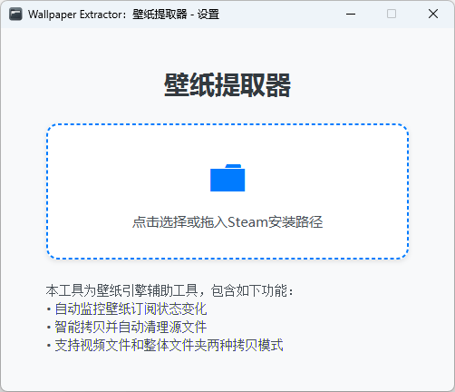
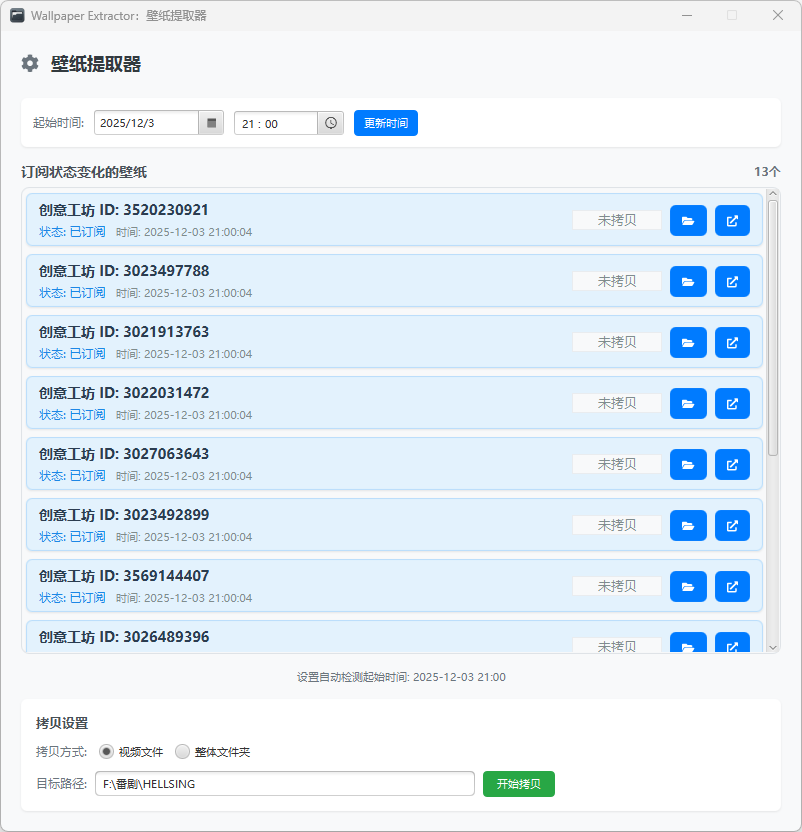

<p align="center">
  
</p>

<p align="center">
    
    
    
    
</p>

# Wallpaper Extractor 🖼️

## 简介 🌟
Wallpaper Extractor 是一个[Wallpaper Engine：壁纸引擎](https://store.steampowered.com/app/431960/Wallpaper_Engine/)壁纸提取工具，基于JavaFX开发。通过实时监控Steam日志文件，自动检测Wallpaper Engine壁纸订阅状态变化，并提供便捷的壁纸提取功能。

## 功能 🚀
- 🔍 **实时监控**：自动监控Steam创意工坊日志文件变化，每秒检测一次
- 🖼️ **智能提取**：支持视频文件拷贝和整体文件夹拷贝两种模式
- ⚙️ **灵活配置**：可设置监控起始时间，支持自定义拷贝路径
- 🎨 **直观界面**：清晰的壁纸列表展示，实时列出订阅状态变化的壁纸
- 📊 **状态管理**：四种拷贝状态（未拷贝、拷贝中、成功、失败）可视化
- 🔄 **自动清理**：拷贝后可自动清理源文件，释放磁盘空间

## 使用方法 📘

### 前置要求
- **Java 21** 或更高版本
- **Gradle** 构建工具
- **Steam** 客户端（用于获取创意工坊壁纸）
- **Wallpaper Engine** 应用

### 安装步骤
1. **克隆仓库**：
   ```bash
   git clone https://github.com/Sun45/WallpaperExtractor.git
   cd WallpaperExtractor
   ```

2. **构建项目**：
   ```bash
   ./gradlew build
   ```

3. **运行应用**：
   ```bash
   ./gradlew run
   ```

4. **打包为可执行文件**（可选）：
   ```bash
   ./gradlew jpackageExe
   ```

### 详细使用说明

#### 1. 初始配置
- 首次运行需要在设置界面配置Steam安装路径
- 应用会自动检测 `Steam/logs/workshop_log.txt` 文件
- 设置拷贝目标路径（默认为桌面WallpaperExtractor文件夹）

#### 2. 监控设置
- **起始时间**：设置监控的起始时间，只检测此时间后的壁纸变化
- **拷贝模式**：
  - **视频文件模式**：仅拷贝目录中的第一个视频文件（支持.mp4, .avi, .mov, .wmv, .flv, .mkv）
  - **文件夹模式**：完整拷贝整个壁纸文件夹结构

#### 3. 壁纸管理
- 检测到订阅/取消订阅的壁纸实时显示在主界面
- 每个壁纸显示订阅时间、订阅状态和拷贝状态
- 手动触发壁纸批量拷贝操作

#### 4. 文件操作
- **拷贝路径**：自定义壁纸文件的保存位置
- **操作方式**：拷贝后自动删除原壁纸文件夹
- **状态跟踪**：实时显示每个壁纸的拷贝状态

## 技术栈 🧰
- [Java 21](https://www.java.com/) - 主要编程语言
- [JavaFX 21.0.6](https://openjfx.io/) - 现代化用户界面框架  
- [Gradle](https://gradle.org/) - 项目构建工具
- 支持Windows平台可执行文件打包

## 项目结构
```
src/main/java/cn/sun45_/wallpaperextractor/
├── WallpaperExtractorApp.java    # 主应用程序类
├── controller/
│   └── MainController.java       # 主控制器
├── model/
│   └── WorkshopListItem.java     # 壁纸列表项模型
├── monitor/
│   ├── FileWatcher.java          # 文件监控器
│   └── WorkshopData.java         # 壁纸数据模型
└── utils/
    ├── FileUtils.java            # 文件操作工具
    └── AppConfig.java            # 配置管理
```

## 运行截图 📷

### 设置界面 - Steam安装路径配置


### 主界面 - 壁纸列表展示和功能按钮


## 许可证 📄
本项目根据 MIT 许可证发布。

## 贡献 💡
欢迎提交 Issue 和 Pull Request 来改进这个项目！

## 投喂支持


感谢支持！🙏
